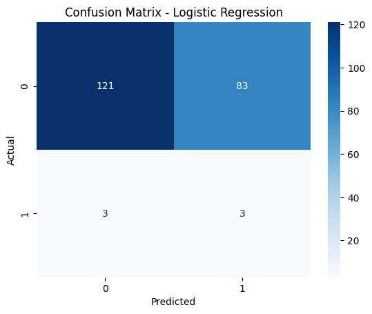
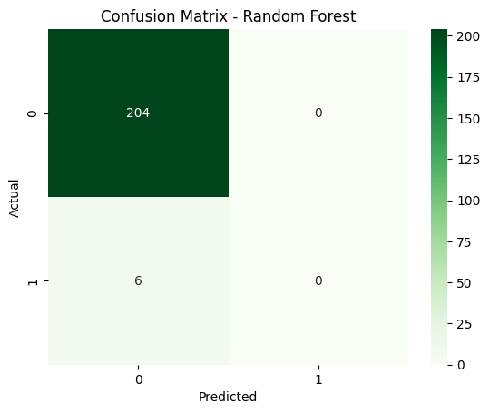
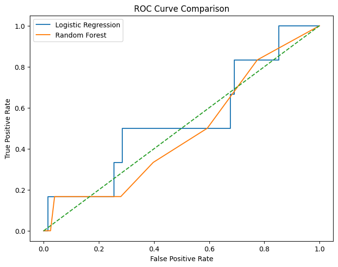
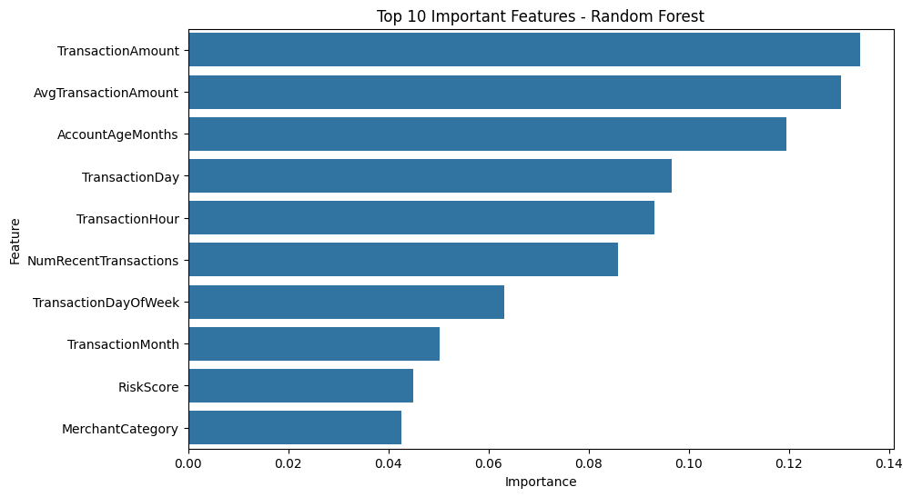

# 💳 Real-Time Digital Payment Fraud Detection using Machine Learning

> An end-to-end Machine Learning pipeline for detecting fraudulent digital payment transactions using feature engineering, predictive modeling, and model evaluation.


---

## 📌 Project Overview

Digital payment systems process millions of transactions every day, making fraud detection a critical cybersecurity and financial challenge. Traditional rule-based systems struggle to detect evolving fraud patterns in real time.

This project develops an end-to-end Machine Learning solution capable of identifying potentially fraudulent payment transactions through intelligent feature engineering and supervised learning.

The complete workflow includes:

- Exploratory Data Analysis (EDA)
- Fraud-specific Feature Engineering
- Data Preprocessing
- Model Development
- Model Evaluation
- ROC Curve Analysis
- Feature Importance Interpretation
- Performance Comparison

---

## 🎯 Objectives

The primary objectives of this project are:

- Detect fraudulent digital payment transactions
- Engineer domain-inspired fraud detection features
- Compare multiple Machine Learning algorithms
- Evaluate models using classification metrics
- Interpret important fraud indicators
- Demonstrate an end-to-end ML workflow suitable for real-world financial analytics

---

# 📂 Dataset

**Dataset:** Time Fraud Detection Dataset

The dataset contains digital payment transaction records including:

| Feature | Description |
|----------|-------------|
| TransactionAmount | Payment amount |
| TransactionType | Type of transaction |
| MerchantCategory | Merchant category |
| DeviceType | Device used |
| GeoLocation | Transaction location |
| Timestamp | Transaction timestamp |
| IsForeignTransaction | Foreign transaction indicator |
| IsHighRiskCountry | High-risk country indicator |
| PreviousFraudCount | Historical fraud count |
| AccountAgeMonths | Customer account age |
| NumRecentTransactions | Recent transaction frequency |
| AvgTransactionAmount | Average historical transaction amount |
| Label | Fraud (1) / Legitimate (0) |

Dataset Size:

- **Rows:** 1,050
- **Features:** 15

---

# 🏗️ Project Workflow

```
Raw Dataset
      │
      ▼
Exploratory Data Analysis
      │
      ▼
Fraud Feature Engineering
      │
      ▼
Data Preprocessing
      │
      ▼
Train-Test Split
      │
      ▼
Machine Learning Models
      │
      ├──────────────► Logistic Regression
      │
      └──────────────► Random Forest
                      │
                      ▼
             Model Evaluation
                      │
                      ▼
      ROC Analysis + Feature Importance
```

---

# ⚙️ Feature Engineering

To improve fraud detection capability, several fraud-oriented features were engineered:

- 🌙 Night Transaction Flag
- 🌍 Location Mismatch Flag
- ⚡ Unusual Transaction Frequency
- 🚨 Composite Risk Score

These engineered variables simulate real-world fraud indicators frequently used in financial risk analytics.

---

# 🤖 Machine Learning Models

Two supervised learning algorithms were implemented:

### 1️⃣ Logistic Regression

A baseline linear classification model providing interpretable probability estimates.

---

### 2️⃣ Random Forest

An ensemble learning algorithm capable of modelling complex nonlinear relationships between transaction characteristics.

---

# 📊 Model Performance

| Metric | Logistic Regression | Random Forest |
|---------|--------------------|---------------|
| Accuracy | 59% | 97% |
| Recall (Fraud Class) | **0.50** | 0.00 |
| ROC-AUC | **0.538** | 0.480 |

> **Observation:**  
> Although Random Forest achieved significantly higher overall accuracy, Logistic Regression identified a larger proportion of fraudulent transactions (higher recall). Since fraud detection prioritizes minimizing false negatives, recall becomes a critical evaluation metric.

---

# 📈 Results

## Logistic Regression Confusion Matrix



---

## Random Forest Confusion Matrix



---

## ROC Curve Comparison



---

## Feature Importance



The Random Forest model identified the following variables as the most influential predictors:

- Transaction Amount
- Average Transaction Amount
- Account Age
- Transaction Time
- Transaction Hour
- Recent Transaction Count
- Transaction Day of Week
- Risk Score
- Merchant Category

---

# 🔍 Key Insights

- Transaction amount is the strongest predictor of fraud.
- Customer behavioural history contributes significantly to fraud identification.
- Feature engineering improves model interpretability.
- Accuracy alone is insufficient for fraud detection due to severe class imbalance.
- Recall is a more meaningful metric when detecting fraudulent transactions.

---

# 🛠️ Tech Stack

- Python
- Pandas
- NumPy
- Matplotlib
- Seaborn
- Scikit-learn
- Jupyter Notebook

---

# 📁 Repository Structure

```
Real-Time-Digital-Payment-Fraud-Detection/
│
├── fraud_detection.ipynb
├── Time_fraud_detection.csv
├── confusion_matrix_logistic.png
├── confusion_matrix_random_forest.png
├── roc_curve.png
├── feature_importance.png
├── README.md
└── LICENSE
```

---

# 🚀 Getting Started

Clone the repository

```bash
git clone https://github.com/akash-cg/Real-Time-Digital-Payment-Fraud-Detection.git
```

Navigate into the project

```bash
cd Real-Time-Digital-Payment-Fraud-Detection
```

Install dependencies

```bash
pip install -r requirements.txt
```

Launch Jupyter Notebook

```bash
jupyter notebook
```

Open

```
fraud_detection.ipynb
```

---

# 📚 Future Improvements

- Handle class imbalance using SMOTE
- Hyperparameter optimization
- XGBoost / LightGBM implementation
- Explainability using SHAP
- Real-time fraud detection pipeline
- Model deployment using Flask or FastAPI
- Stream processing using Apache Kafka
- Cloud deployment on AWS

---
---
